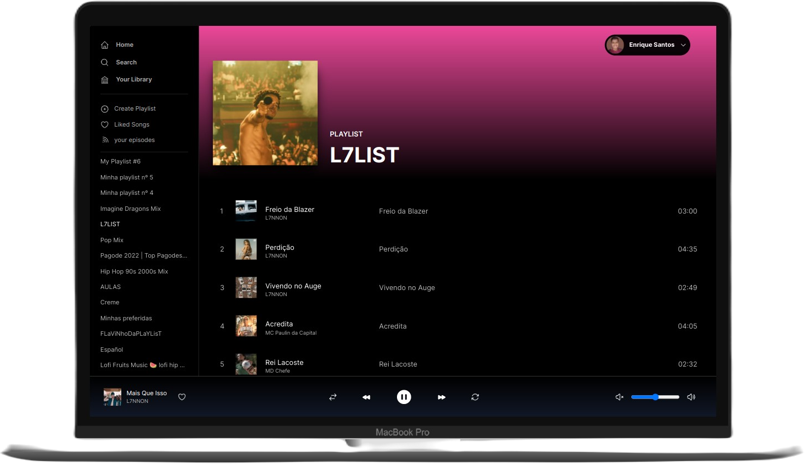
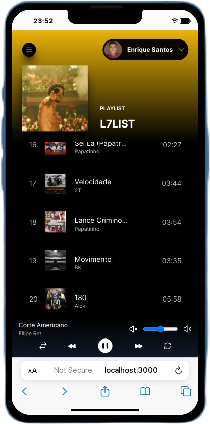

# Spotify Web Play Clone


Esse Projeto é um clone do spotify web que implementa as funções de playback do usúario. Esse projeto foi feito utilizando a api do spotify e com o axios para os serviços http do lado do client. Por se tratar de um web app feito com a api do spotify no final das contas ele nada mais é que um controle remoto para o seu spotify oficial, ou seja, para que tudo funcione bem você tem que está conectado no seu aplicatio do spotify ou no spotify web.


Ok, passado uma visão inicial de como o projeto foi pensado vamos a alguns detalhes de segurança. Para pode acessar o app no início da sua sessão será pedido que você faça login e aceite que o aplicativo tenha acesso a algumas informações sobre a sua conta do spotify, ressalto que os dados que você está me dando acesso são somente utilizados para fins de demo do aplicativo, a seguir os scopos que eu peço autorização.

```
  1. user-read-private,
  2. user-read-email,
  3. user-top-read,
  4. user-follow-read,
  5. user-library-modify,
  6. playlist-modify-private,
  7. user-read-playback-state,
  8. user-modify-playback-state,
  9. user-read-currently-playing,
  10. user-read-recently-played,
  11. user-library-read,
  12. streaming,
  13. playlist-read-private,
  14. playlist-read-collaborative,
  15. playlist-modify-private,
  16. playlist-modify-public,
  17. user-follow-read,
```

Você pode consultar sobre os escopos nas documentações do spotify.
[https://developer.spotify.com/documentation/general/guides/authorization/scopes/](https://developer.spotify.com/documentation/general/guides/authorization/scopes/)


## Tecnologias utilizadas

Para esse projeto foi utilizado 3 tecnologias: typescript, tailwindcss e NextJS


## Funcionalidades da aplicação.

1. Listar suas playlists.
2. Dá play em uma música.
3. Pausar uma música.
4. Passar a música, obs: desde de que tenha uma próxima música na sua fila de espera do spotify, não tendo simplismente não acontece nada.
5. Voltar para música anterior, essa função tem a mesma observação da funcionalidade acima, porém no caso de ter uma música para voltar.
6. Colocar o estado do playback como aleátorio, obs: essa função vai funcionar caso você esteja escutando uma playlist no spotify.
7. Curtir uma música
8. Colocar a música ou playlist em loop.


## Demo da aplicação. Esse projeto foi hospeado na vercel e você pode acessar pelo link abaixo.

[https://spotify-web-player-clone.vercel.app](https://spotify-web-player-clone.vercel.app/)


## UI do projeto.

#### Desktop




</br>

#### Mobile

<div align="center">
  
</div>


## Executando na sua prórpia máquina.
Para executar o projeto é necessário algum passos e requisitos. O primeiro requisito é ter o NodeJs instalado na sua máquina o segundo é ter o git para clonar o projeto.

#### Passo 1
Clone o projeto com o comando.
```bash
git clone https://github.com/EnriqueSantos-dev/Spotify-Web-Player-Clone
```

#### Passo 2
Agora um passo importante é cria um app no spotify para pode fazer as chamadas para a api.

Siga o passo a passo da documentação
</br>
[https://developer.spotify.com/documentation/general/guides/authorization/app-settings/](https://developer.spotify.com/documentation/general/guides/authorization/app-settings/)

#### Passo 3
Depois de criado o seu app no spotify é necessário criar um arquivo env na raiz do projeto. Para facilitar eu deixei um arquivo env.example, cria um arquivo .env na na raíz do projeto, copie o que tem no arquivo .env.example e subistitua as variáveis necessárias pelos dados do seu app do spotify, somente é necessário mudar o valor da variável ```SPOTIFY_CLIENT_SECRET``` e ```SPOTIFY_CLIENT_ID```.

#### Passo 4
Após todas essas etapas resta somente executar o comando
```bash
npm install
```
para instalar as depências do projeto. E depois
```bash
npm run dev
```
para iniciar a aplicação.
